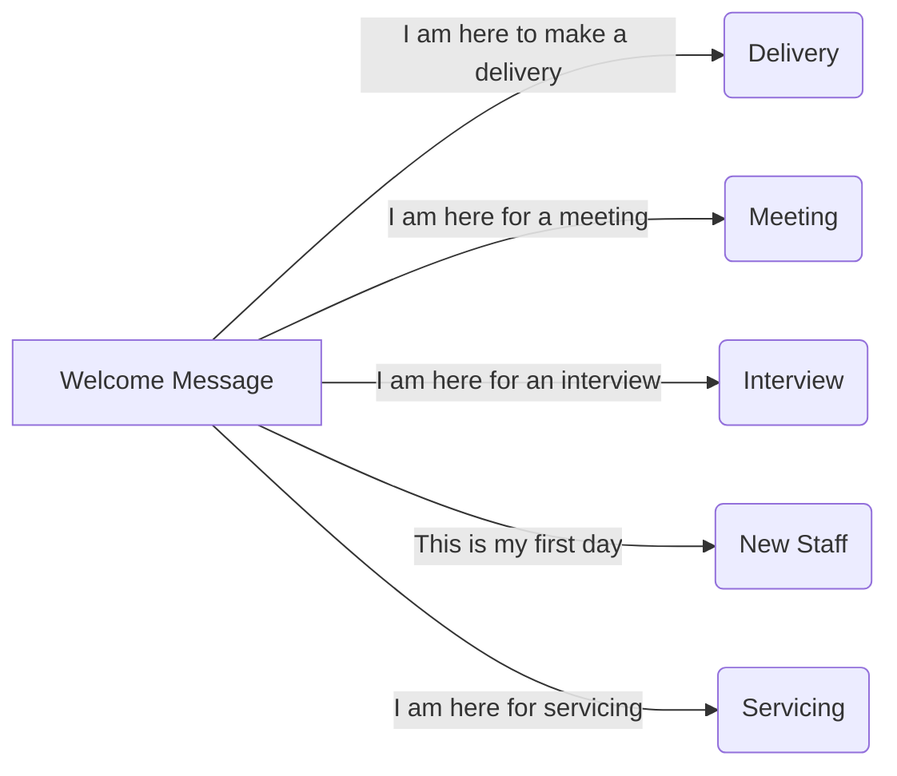

# Rasa Receptionist Bot (Streamlined)V2

## Description
This Rasa chatbot serves as a smart virtual receptionist in an office setting, handling various types of visitors and purposes of visit, including deliveries, meetings, door opening, and other basic functions such as telling time. 

## Screenshots
#### Examples of the bot running in Terminal:


Asking for time:


Delivery:


Interview:


Meeting:


Servicing:

## Tech/framework used

- Rasa open source


## Files in Rasa Folder
A brief rundown of the purpose of some of the files, which are closely interconnected with one another.

<a href="https://ibb.co/MCmsThG"></a>

- actions.py
	This file contains all written Python code of custom actions.
	
- config.yml
	This file contains configurations for Rasa NLU and Rasa Core,  such as tokenizers and policies.
- credentials.yml
	This file contains the credentials for the voice & chat platforms which the bot is using. 	
- data
	- nlu.md
		This file contains all the intents and their variations.
	- stories.md
		This file contains different variations of paths that a user might go through. 
- domain.yml
	This file contains the actions, utters, entities, forms, slots, responses and buttons that are used.
- endpoints.yml
	This file contains the different endpoints the bot can use.
- models
	This folder contains model(s) which are trained. 
	

## Conversational Workflow

#### Main paths of workflow:


#### Full workflow and functions:


## Installation

**Rasa Quick Installation**

You can install Rasa Open Source using pip (requires Python 3.6 or 3.7). It is strongly recommended to create a virtual environment.

```bash
$ pip3 install rasa
```

For full installation guide, check out the [Rasa Documentation](https://rasa.com/docs/rasa/user-guide/installation/).

## Running locally
The bot can be run on Terminal locally. The bot calls the action server via the url specified under endpoints.yml.

**1. Run Rasa Shell**
In a Terminal tab in your bot directory,  enter this command line to run rasa: 
```bash
rasa shell
```
Alternatively, to see debugging information in Terminal as the program runs, you can append the debug property:
```bash
rasa shell --debug
```

**2. Run Action Server**
Running the action server is necessary to utilise the custom actions writtten in actions.py.
To run the action server, open up another tab in Terminal and enter this command line:
```bash
rasa run actions 
```
### Demo:


## Comparison with Web-based bot

This project is a streamlined version of another web-based Rasa receptionist bot we built with more comprehensive features and a different scope, which is hosted on a front-end user interface on [this webpage](http://ycampus.southeastasia.cloudapp.azure.com:3010/). 
(Link updated as of 03/07/2020)


||Streamlined (this version)|Web-based  |
|--|--|--|
|Functionality |Helps visitors to find staff|Helps visitors find staff, course registration, room booking, office map, notifications and attendance
|Input|Voice input only|Voice, text, button clicks|
|User Interface|Game-based design|React|
|Casual Conversation|User can ask for date and time, directions to the MRT, and about Yoozoo|No casual conversation|
|Name Extraction|Asks for staff's name only|Asks for both visitors' and staff's names|
|Incorrect Extraction|Bot repeats process|Bot requests user to type in chat bubble|
|Bot Response|Unique bot responses depending on purpose of visitor|For simplicity, bot response is the same regardless of visitor's purpose|
|For services|Does not require staff's name to get someone to open the door|Still require staff's name|


## Credits

While working on this project, we referenced the [Rasa Official Documentation](https://rasa.com/docs/rasa/).

Furthermore, we would like to express our gratitude to our mentors Ng Wai Foong and San Lin for their patience and guidance as we work on this project.


### Thanks for reading :)
